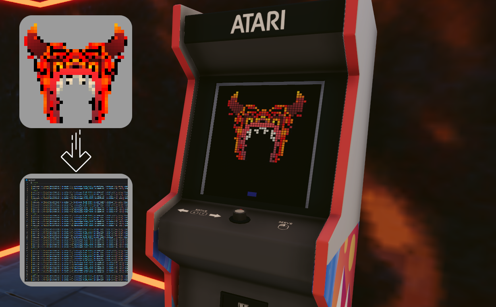

# Image to TypeScript array

This script takes an input image and generates a valid TypeScript array of each pixel value.

It is intended for use with the [Decentraland Atari Arcade Cabinets](https://github.com/decentraland-scenes/atari-arcade-cabinets) and allows you to create your own custom logo easily from the input image.

## Use:

* Clone the repo locally.
* Place your image in the repo folder
* Either rename your image to `input.png`, or edit the `image_path` in `main.py`
* Images should be 32x32 pixels for best results
* Open a terminal with access to pythton
* Call the script with: `python3 main.py`
* The results will be printed to `output.ts`. Copy this to the relevant files for the cabinet.

# Credit

This code was written by stom for the [Inferno Room](https://play.decentraland.org/?position=-60%2C125) cabinets. The credit for the example logo in the repo belongs to [@arnjjoe](https://twitter.com/arnjjoe) and is used with permission.

# License

The code in this addon is licensed under the MIT License. Please see [LICENSE](LICENSE) for details.